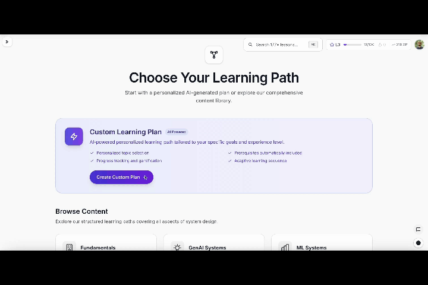

# SystemDesigner

**Learn system design end-to-end — for free, in your browser.** Interactive lessons, quizzes, calculators, and a diagramming sandbox covering classic distributed systems, modern GenAI systems, and ML systems engineering.

[](https://systemdesigner.net)
[](./LICENSE)
[](./LICENSE-CONTENT)
[](./CONTRIBUTING.md)
[](https://nextjs.org)
[](#-acknowledgements--star-the-repo)

### 👉 [Start learning at systemdesigner.net](https://systemdesigner.net)

### Continue the daily-learning project

The development version of `/learn` has four courses—System Design, Coding, Generative AI, and Machine Learning—with 45 units, 272 sessions, and 235 skills. It includes unit placement, reviews that respond to practice evidence, 33 runnable JavaScript exercises, XP, goals, and streaks. All 202 lesson sessions use hand-authored practice: 202 packs with 961 groups and 2,883 variants, spread across ordering, calculation, matching, and scenario-decision exercises. A guided journey of 325 study days in 15 parts connects every session across all four courses in order, with 53 review days, 25 milestones, and a coding project at the end of each of the first four months. The phone layout has full-screen practice and persistent actions; home-screen installation and previously visited exercises work offline after preparation. Interrupted quizzes and exercises resume, and recent code versions can be recovered. Progress saves locally and optionally syncs to an account; backup utilities live in learning settings. Production release is a separate delivery step.

**Resuming on another machine or in a new coding session? Start with [Continue development](./docs/CONTINUE_DEVELOPMENT.md).** It contains setup commands, the implementation map, current limits, and the next milestone. The [product roadmap](./ROADMAP.md) is also available in the app at `/roadmap`.

---

## What is SystemDesigner?

SystemDesigner is a free, open-source platform that turns "I should probably learn system design" into a guided, hands-on journey. Instead of a wall of text, you get **425 structured content entries**, **interactive quizzes across the curriculum**, **hands-on calculators** for back-of-the-envelope math, and a **tldraw diagramming sandbox** to sketch architectures as you go. Learning paths track your progress and stitch lessons into prerequisite-aware sequences — so you always know what to learn next.

It covers the full spectrum: classic distributed-systems design (caching, sharding, queues, consistency), **modern GenAI systems** (RAG, agents, evals, token economics), and **ML systems engineering** (feature stores, serving, monitoring). Every concept follows one editorial rule — **"Explain before you dive deep"** — so each topic opens with a plain-language *"What is [Concept]?"* intro you can grasp in 15–30 seconds, then progressively unfolds into the trade-offs.

The app runs fully anonymously with zero configuration. Sign-in is optional and only used to sync progress across devices and save your diagrams.



> _Maintainers: this demo lives at `public/screenshots/desktop-demo.gif` — swap it for a fresh capture when the UI changes._

---

## ✨ Features

### 📚 Learn
- **300+ lessons** across 8 sections — fundamentals, GenAI, ML systems, technology deep-dives, case studies, reference, and tools.
- **Learning paths & progress tracking** — prerequisite-aware sequences that always tell you what to study next.
- **"Explain before you dive deep"** — every concept opens with a beginner-friendly intro before the trade-offs.
- **Dark mode** throughout.

### 🧠 Practice
- **Interactive quizzes throughout the curriculum** — co-located lesson quizzes and the shared quiz bank test understanding on every topic.
- **Practice problems** — structured, interview-style walkthroughs (clarify → estimate → architect → deep-dive → operate) for system design, ML systems, and GenAI systems.

### 🛠️ Build
- **Interactive calculators** — latency, throughput, cost, and capacity estimates with live sliders.
- **tldraw diagramming sandbox** — sketch architectures right in the browser; sign in to save and sync them.

---

## 🎓 What you'll learn

| Section | What it covers | Entries |
| --- | --- | --- |
| **Technology** | Deep-dives into specific tools & frameworks (databases, queues, caches, infra) | 136 |
| **GenAI** | LLMs, RAG, agents, evals, prompt engineering, token economics | 76 |
| **ML Systems** | Feature stores, training/serving pipelines, monitoring, ML infra | 61 |
| **Fundamentals** | Core distributed-systems concepts (CAP, sharding, consistency, caching) | 50 |
| **Practice** | Interview-style design exercises with structured walkthroughs | 29 |
| **Reference** | Quick references, formulas, and back-of-the-envelope cheat sheets | 27 |
| **Tools** | Interactive calculators and hands-on utilities | 26 |
| **Case Studies** | Real-world system breakdowns end-to-end | 20 |
| **Total** | | **425** |

---

## 🚀 Quick start

**Prerequisites:** [Node.js 20+](https://nodejs.org) and [pnpm 10.4.1](https://pnpm.io).

```bash
# 1. Clone
git clone https://github.com/alibad/systemdesigner.git
cd systemdesigner

# 2. Use the pinned pnpm version
corepack enable
corepack prepare pnpm@10.4.1 --activate

# 3. Install dependencies
pnpm install

# 4. Run the dev server
pnpm dev
```

Open [http://localhost:3000](http://localhost:3000) — that's it. **The app runs with zero config and works fully anonymously**, no environment variables required. Sign-in (Firebase) is optional and only needed for cross-device progress sync and saving diagrams.

### Do I need secrets?

No. New contributors should not set up secrets just to run the app, fix content, add quizzes, edit calculators, or open a PR.

Only set up environment variables when you are working on a feature that actually needs them:

| Feature area | Setup needed |
| --- | --- |
| Auth, cross-device progress, cloud-saved diagrams | Firebase web config (`NEXT_PUBLIC_FIREBASE_*`) |
| Admin screens on your own fork | `NEXT_PUBLIC_ADMIN_EMAILS` |
| Feedback widget creating GitHub issues | GitHub App credentials |
| AI helpers or maintainer content-generation tooling | `OPENAI_API_KEY` |
| Production SEO verification | `GOOGLE_SITE_VERIFICATION` |

`NEXT_PUBLIC_*` values are public browser config, not server secrets. Real secrets, like OpenAI keys and GitHub App private keys, belong only in `.env.local` or your hosting provider's secret manager.

Deploying your own fork? See [docs/DEVELOPMENT.md](./docs/DEVELOPMENT.md) for the full list of (all optional) environment variables.

---

## 🤝 Contributing

**You don't need to write code to improve a lesson.** SystemDesigner is built to make contributions easy, whether you spotted a typo or want to author a whole new topic.

- ✏️ **Edit this page on GitHub** — every lesson page has a deep link that opens the exact source file in GitHub's editor. Fix it, propose a change, done.
- 💡 **Suggest an improvement** — every lesson also links to a prefilled GitHub issue (the content-improvement form), so you can flag a problem in seconds.
- 🧩 **Propose new content** — structured Issue Forms let you propose a new lesson, quiz, or calculator.
- 🐛 **Report bugs & request features** — dedicated Issue Forms, plus [GitHub Discussions](https://github.com/alibad/systemdesigner/discussions) for questions and ideas.
- 🌱 **Good first issues** are labeled `good first issue`.

Pull requests follow the [PR template](./.github/PULL_REQUEST_TEMPLATE.md); CI scans for obvious secrets, validates content, runs tests, lints, and builds.

👉 Start with **[CONTRIBUTING.md](./CONTRIBUTING.md)**, and for authoring lessons read the **[Content Guide](./docs/CONTENT_GUIDE.md)**.

---

## 🗂️ Project structure

```text
systemdesigner/
├── app/                        # Next.js App Router and shared section [slug] routes
├── content/entries/            # Canonical registry-driven content bodies
│   └── [section]/[slug]/
│       ├── index.mdoc          # The lesson body (path must match the registry)
│       ├── code/               # Co-located code examples, served via /api/content/[...]
│       ├── quiz/               # Canonical lesson quiz JSON
│       └── data/               # Other structured lesson data
├── lib/
│   ├── content-registry.ts     # ⭐ Single source of truth — every content entry's metadata
│   └── quiz-bank/
│       └── all-quizzes.json    # Shared/legacy quiz bank for entries that reference quizId
├── components/                 # Shared UI — CodeBlock, InteractiveQuiz, LessonHeader, calculators/
├── docs/                       # CONTENT_GUIDE, ARCHITECTURE, DEVELOPMENT
├── scripts/                    # validate-content-registry.cjs, generate-quiz-bank.cjs
└── public/                     # Static assets (screenshots/demo, icons, generated imagery)
```

The **content registry** (`lib/content-registry.ts`) is the heart of the system — navigation, learning paths, sitemaps, and SEO are all generated from it. Validate it anytime with:

```bash
pnpm validate:registry   # the content registry gate CI runs
pnpm check               # full local pre-PR check
```

---

## 🧱 Tech stack

- **Next.js 14** (App Router), **React 18**, **TypeScript**, **Tailwind CSS**
- **Firebase** (Auth, Firestore, Storage) — accounts, progress sync, saved diagrams (all optional; the app works anonymously)
- **tldraw** — the in-browser diagramming sandbox
- **MDX** (`next-mdx-remote`) — for some reference content
- **OpenAI API** — optional, maintainer-side content-generation tooling only; never required to run the app
- **pnpm** (10.4.1) · **Node 20+**

---

## 📖 Documentation

| Doc | What's inside |
| --- | --- |
| [docs/CONTINUE_DEVELOPMENT.md](./docs/CONTINUE_DEVELOPMENT.md) | New-machine handoff, current daily-learning state, next task, and verification |
| [docs/daily-learning-path.md](./docs/daily-learning-path.md) | Daily path implementation, progression rules, coding runner, and content |
| [CONTRIBUTING.md](./CONTRIBUTING.md) | How to contribute — fixes, new content, PRs |
| [docs/CONTENT_GUIDE.md](./docs/CONTENT_GUIDE.md) | Authoring lessons, quizzes & calculators (the content system) |
| [docs/ARCHITECTURE.md](./docs/ARCHITECTURE.md) | How the app & content registry fit together |
| [docs/DEVELOPMENT.md](./docs/DEVELOPMENT.md) | Local setup, env vars, scripts, deployment |
| [docs/OPEN_SOURCE_AUDIT.md](./docs/OPEN_SOURCE_AUDIT.md) | Maintainer checklist before publishing the repo |
| [docs/MAINTAINER_RELEASE.md](./docs/MAINTAINER_RELEASE.md) | How maintainers create a sanitized public release |
| [ROADMAP.md](./ROADMAP.md) | Where the project is headed & where to help |
| [GOVERNANCE.md](./GOVERNANCE.md) | How decisions are made & how to become a maintainer |
| [CODE_OF_CONDUCT.md](./CODE_OF_CONDUCT.md) | Community standards |
| [SECURITY.md](./SECURITY.md) | Reporting security issues |
| [SUPPORT.md](./SUPPORT.md) | Where to get help |

Deeper authoring standards live in [`AGENTS.md`](./AGENTS.md). Need help? See [SUPPORT.md](./SUPPORT.md) or email the community list at **system-designer@googlegroups.com**.

---

## 📜 License

SystemDesigner uses a **dual license**:

- **Code** — [MIT](./LICENSE). Use it, fork it, build on it.
- **Content** (lessons, quizzes, written docs, illustrations) — [Creative Commons Attribution-ShareAlike 4.0 International (CC BY-SA 4.0)](./LICENSE-CONTENT).

When reusing content, please attribute **"SystemDesigner (systemdesigner.net)"** and link back to the source.

---

## 🙌 Acknowledgements & star the repo

SystemDesigner is a community effort to make world-class system design education free and open to everyone. Huge thanks to every contributor who fixes a lesson, files an issue, or authors a new topic.

If this project helps you learn, **please ⭐ [star the repo](https://github.com/alibad/systemdesigner)** — it genuinely helps others discover it.

Questions or ideas? Open a [Discussion](https://github.com/alibad/systemdesigner/discussions), join **system-designer@googlegroups.com**, or reach the maintainer at **alibadereddin@gmail.com**.
