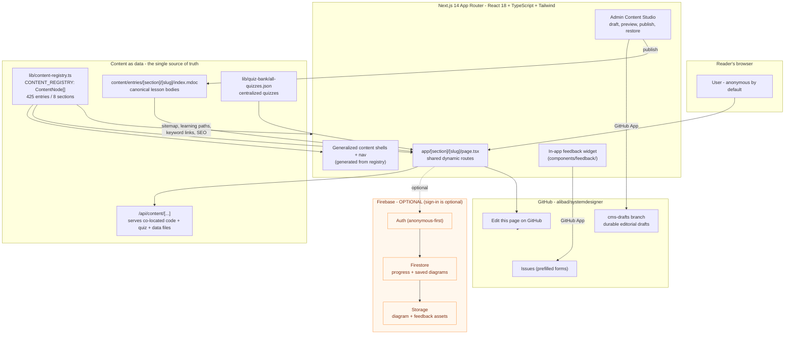

# Architecture

A contributor-facing tour of how **SystemDesigner** ([systemdesigner.net](https://systemdesigner.net)) is put together. Read this once and you'll know where any change lives, why the content registry is the heart of the project, and how a canonical content entry flows through the generalized renderer to a GitHub issue.

> **TL;DR for contributors:** Content is **data**, not page components. `lib/content-registry.ts` drives navigation, sitemaps, learning paths, keyword linking, and SEO. Add an entry there first, then create `content/entries/<section>/<slug>/index.mdoc`. Everything else flows from that.

If you're here to *write or fix a lesson*, you may want [docs/CONTENT_GUIDE.md](./CONTENT_GUIDE.md) instead. To *set up your machine*, see [docs/DEVELOPMENT.md](./DEVELOPMENT.md). For the deep authoring standards that this doc links to, see [CLAUDE.md](../CLAUDE.md) and [AGENTS.md](../AGENTS.md).

---

## The big picture



**Reading the diagram:** the App Router frontend reads from the **content registry** and **quiz bank** at build/render time; co-located code and quiz files are served through `/api/content/[...]`. Firebase is entirely optional — the app runs and teaches with zero accounts and zero env vars. When a reader files feedback, an optional server-side bridge turns it into a GitHub issue.

---

## Content as data

The most important idea in this codebase: **content is structured data, and the data drives the app.**

### `lib/content-registry.ts` — the single source of truth

The registry exports `CONTENT_REGISTRY: ContentNode[]`. Every lesson, reference, calculator, case study, and practice problem is one `ContentNode`:

```ts
interface ContentNode {
  id: string;          // slug, unique
  title: string;
  path: string;        // /section/slug  — MUST match the content entry directory
  section: 'fundamentals' | 'genai' | 'ml-systems' | 'technology'
         | 'case-studies' | 'practice' | 'reference' | 'tools';
  level: 'beginner' | 'intermediate' | 'advanced';
  duration: string;
  hasQuiz: boolean;
  prerequisites: string[];   // ids that come before this one
  related: string[];         // ids of complementary content
  tags: string[];
  seo: {
    metaDescription: string; // <= 160 chars
    keywords: string[];
    priority: number;
    changeFreq: string;
    lastModified: Date;
  };
  status: string;
}
```

There are **425 entries across 8 sections**:

| Section | Entries |
|---|---|
| `technology` | 136 |
| `genai` | 76 |
| `ml-systems` | 61 |
| `fundamentals` | 50 |
| `practice` | 29 |
| `reference` | 27 |
| `tools` | 26 |
| `case-studies` | 20 |

From this one array, the app derives:

- **Navigation** — section sidebars and ordering (via `lib/nav-generators.ts`), so you never hand-maintain a nav config.
- **Sitemaps & SEO** — `seo` metadata, canonical URLs, and sitemap priorities are generated, not written per page.
- **Learning paths** — `prerequisites[]` and `related[]` form the prerequisite chains and "what to read next" sequencing.
- **Keyword linking** — `lib/keyword-linking.ts` indexes titles, tags, and SEO keywords to auto-link concepts across lessons.

Because of this, the **registry is the gate**: CI runs the strict registry validator, which checks for duplicate ids/paths, broken prerequisite/related references, over-long SEO descriptions, and missing tags. **Add to the registry before creating a body**, then run the validator locally.

### The quiz bank

Quizzes are centralized in `lib/quiz-bank/all-quizzes.json` or co-located in an entry's `quiz/` directory, keyed by `quizId`. A Markdoc body renders its quiz with:

```md

```

Regenerate or rebuild the bank with `node scripts/generate-quiz-bank.cjs`. See [docs/CONTENT_GUIDE.md](./CONTENT_GUIDE.md) for the quiz schema.

### Co-located assets via `/api/content/[...]`

Code examples and quiz/data files live **next to their lesson body**, not inside a page component:

```
content/entries/[section]/[slug]/
├── index.mdoc
└── code/
    ├── example.py
    └── service.yaml
```

These files are excluded from TypeScript compilation and served through `app/api/content/[...path]/route.ts`, which resolves the canonical entry with containment checks, detects the MIME type, and applies environment-aware caching. Bodies reference them by URL:

```md

```

This keeps large code blocks out of Markdoc and React source while staying version-controlled and IDE-friendly.

---

## Directory map

```
systemdesigner/
├── app/                         # Next.js App Router and shared section [slug] routes
│   ├── api/
│   │   ├── content/[...path]/       # Serves co-located code + quiz + data files
│   │   ├── quiz-bank/[id]/          # Serves quizzes from the centralized bank
│   │   └── feedback/                # In-app feedback -> GitHub Issues bridge
│   └── (section layouts, sitemap, etc.)
│
├── content/entries/             # Canonical registry-driven content
│   └── [section]/[slug]/
│       ├── index.mdoc              # Editorial body
│       └── code/quiz/data/         # Co-located assets
│
├── lib/                         # Core logic & the data layer
│   ├── content-registry.ts         # ⭐ SINGLE SOURCE OF TRUTH (CONTENT_REGISTRY)
│   ├── quiz-bank/all-quizzes.json   # ⭐ Central quiz bank, keyed by quizId
│   ├── firebase.ts                  # Firebase client init (Auth/Firestore/Storage)
│   ├── site-config.ts               # App URL, repo/branch, feature flags, env reads
│   ├── nav-generators.ts            # Builds section nav/configs FROM the registry
│   ├── keyword-linking.ts           # Auto-links keywords across content
│   └── stores/                      # Client state stores
│
├── components/
│   ├── shared/                      # CodeBlock variants, common UI
│   ├── calculators/                 # Interactive calculators (direct imports)
│   ├── content/                     # Generalized route renderer and shell policy
│   ├── content-blocks/              # Focused typed interactive islands
│   ├── markdoc/                     # Markdoc tags and renderer
│   ├── fundamentals/                # LessonHeader, InteractiveLearning (InteractiveQuiz)
│   └── feedback/                    # In-app feedback widget
│
├── hooks/                       # Reusable React hooks
├── contexts/                    # React context providers (auth, progress, theme, ...)
├── scripts/                     # validate-content-registry.cjs, generate-quiz-bank.cjs, ...
├── docs/                        # This file + CONTENT_GUIDE.md, DEVELOPMENT.md
├── marketing/                   # ⚠️ Separate standalone landing app — NOT the main site
├── CLAUDE.md / AGENTS.md        # Deep authoring + engineering standards
└── lib/quiz-bank, public/, etc.
```

> **Note on `marketing/`:** it's a *separate, standalone landing application*. Changes to the learning platform almost never touch it — don't confuse it with `app/`.

---

## Key subsystems

**Content Registry.** `lib/content-registry.ts` is the spine of the project (described above). If you remember one thing: nav, sitemaps, learning paths, keyword links, and SEO are all *generated* from it, and `node scripts/validate-content-registry.cjs` must pass before anything merges.

**Quiz Bank.** `lib/quiz-bank/all-quizzes.json` and co-located entry JSON hold quizzes, served through the quiz/content APIs and rendered by the `quiz` Markdoc tag. Quiz data stays decoupled from route layout.

**Progress & Gamification.** Reader progress (lessons completed, quiz scores, learning-path position) is tracked client-side and — when signed in — synced to Firestore for cross-device continuity. Completion components live alongside lesson layouts; the registry's `nextInSequence`/`prerequisites` define the path a learner walks.

**Auth (Firebase, anonymous-first).** Sign-in is **optional**. The app fully works anonymously — sign-in only adds cross-device progress sync and the saved-diagram feature. `lib/firebase.ts` initializes the client SDK from `NEXT_PUBLIC_FIREBASE_*` env vars (these are public by design and secured by Firestore rules). With no env vars at all, the app falls back to anonymous-only mode.

**Diagramming Sandbox (tldraw).** A whiteboard for sketching architectures, with saved diagrams persisted to Firebase for signed-in users. **⚠️ CRITICAL rule:** never call `store.loadSnapshot()` on a `TLStore` — it triggers schema-migration errors. Always pass the snapshot to the component via the `snapshot` prop: `<Tldraw snapshot={{ store: recordsMap }} />`. The full pattern and the *why* live in [CLAUDE.md](../CLAUDE.md#whiteboard--tldraw-guidelines) — read it before touching diagram code.

**Keyword Linking.** `lib/keyword-linking.ts` builds an index from the registry (titles, tags, SEO keywords) and auto-links concepts inside lesson text, with relevance scoring, self-link prevention, and section-based color coding. It's wired in at the layout level, so most pages get smart cross-links for free.

**Content Studio.** Authenticated admins edit registry-backed Markdoc at `/admin/content/editor`. The workflow separates autosaved drafts from published lesson source, validates the same Markdoc schema used by the renderer, previews the rendered tree, detects public-source conflicts, and supports revision restore. Local development stores ignored editorial state under `.content-cms/`; GitHub persistence stores drafts on `GITHUB_CMS_DRAFT_BRANCH` and publishes commits to the public content branch.

**Feedback → GitHub Issues.** The in-app feedback widget (`components/feedback/`, `app/api/feedback/`) lets readers report bugs or suggest improvements without leaving the page. When a **GitHub App** is configured server-side, the API route opens a prefilled GitHub issue automatically. Every lesson also exposes **"Edit this page on GitHub"** and **"Suggest an improvement"** links; edit links target `content/entries/<section>/<slug>/index.mdoc` and require no credentials.

---

## Rendering & data flow

**Server vs client components.** Shared `[slug]` routes and Markdoc rendering stay server-first for fast first paint and SEO. Quizzes, calculators, design challenges, and other focused behavior hydrate as client islands. `GeneralizedContentPage` selects the section shell and owns route chrome.

**The three CodeBlock variants** (all import from `@/components/shared/CodeBlock`, named import, with a `file=` prop):

| Component | When to use | Loads content |
|---|---|---|
| `CodeBlock` | Client components needing full interactivity (copy, expand, highlight) | Fetches via `/api/content/...` |
| `SSRCodeBlock` | Server contexts that should pre-load then hydrate to interactive | Server-side, then hydrates |
| `ServerCodeBlock` | Pure static HTML, no JavaScript needed | Server-side only |

**Calculators** are reusable React components in `components/calculators/`; route-specific behavior lives in `components/content-blocks/entries/` and is referenced with `interactive-block`.

**Env & site-config.** Runtime configuration flows through `lib/site-config.ts`, which reads the canonical env vars. The app runs **locally with no env vars at all** by using an inert local Firebase config; env vars matter only for your own deployment or fork:

- Public (`NEXT_PUBLIC_*`, safe to expose): `NEXT_PUBLIC_FIREBASE_API_KEY`, `NEXT_PUBLIC_FIREBASE_AUTH_DOMAIN`, `NEXT_PUBLIC_FIREBASE_PROJECT_ID`, `NEXT_PUBLIC_FIREBASE_STORAGE_BUCKET`, `NEXT_PUBLIC_FIREBASE_MESSAGING_SENDER_ID`, `NEXT_PUBLIC_FIREBASE_APP_ID`, `NEXT_PUBLIC_FIREBASE_MEASUREMENT_ID`, `NEXT_PUBLIC_ADMIN_EMAILS`, `NEXT_PUBLIC_GITHUB_REPO` (e.g. `alibad/systemdesigner`), `NEXT_PUBLIC_GITHUB_BRANCH` (default `main`), `NEXT_PUBLIC_APP_URL` (e.g. `https://systemdesigner.net`).
- Server-only (never `NEXT_PUBLIC`): the GitHub App credentials for feedback and durable Vercel-hosted content drafts/publishing (`GITHUB_APP_ID`, `GITHUB_APP_INSTALLATION_ID`, `GITHUB_APP_PRIVATE_KEY` or `GITHUB_APP_PRIVATE_KEY_PATH`, `GITHUB_REPO_OWNER`, `GITHUB_REPO_NAME` — all optional), `ADMIN_CONTENT_PERSISTENCE` (optional `filesystem`/`github` override), `GITHUB_CMS_DRAFT_BRANCH` (optional, defaults to `cms-drafts`), `OPENAI_API_KEY` / `OPENAI_MODEL` (optional, maintainer content tooling only — never required to run the app), `GOOGLE_SITE_VERIFICATION` (optional, SEO).

See [docs/DEVELOPMENT.md](./DEVELOPMENT.md) for the full setup.

---

## Where to make changes

| I want to... | Edit / run |
|---|---|
| Add a new lesson, reference, or calculator | Add an `mdoc` `ContentNode`, then create `content/entries/[section]/[slug]/index.mdoc` |
| Fix wording in an existing lesson | `content/entries/[section]/[slug]/index.mdoc` (or click "Edit this page on GitHub") |
| Add/edit a code example | Drop a file in the entry's `code/` directory, reference it via `code-block` |
| Add or change a quiz | `lib/quiz-bank/all-quizzes.json` (keyed by `quizId` = slug), then `node scripts/generate-quiz-bank.cjs` |
| Change nav/order in a section | Edit registry fields (order, prerequisites); nav is generated by `lib/nav-generators.ts` |
| Tune cross-lesson keyword links | `lib/keyword-linking.ts` |
| Build an interactive calculator | Reuse `components/calculators/` or add a focused typed island under `components/content-blocks/entries/` |
| Touch the diagram sandbox | tldraw code — read the **never-use-`loadSnapshot`** rule in [CLAUDE.md](../CLAUDE.md#whiteboard--tldraw-guidelines) first |
| Adjust auth / progress sync | `lib/firebase.ts`, `contexts/`, `lib/stores/` |
| Change the in-app feedback widget | `components/feedback/`, `app/api/feedback/` |
| Change global config (URL, repo, branch) | `lib/site-config.ts` + the relevant env vars |
| Validate before committing | `pnpm audit:content && pnpm validate:registry --strict && pnpm validate:content && pnpm typecheck && pnpm build` |
| Edit the standalone landing page | `marketing/` (separate app — not the main site) |

---

## Further reading

- [CLAUDE.md](../CLAUDE.md) — deep authoring + engineering standards (content registry, templates, tldraw rules, the "explain before you dive deep" principle, layout widths).
- [AGENTS.md](../AGENTS.md) — agent/automation conventions.
- [docs/CONTENT_GUIDE.md](./CONTENT_GUIDE.md) — how to write lessons, quizzes, and calculators.
- [docs/DEVELOPMENT.md](./DEVELOPMENT.md) — local setup, scripts, and env vars.
- [CONTRIBUTING.md](../CONTRIBUTING.md) — the contribution workflow and PR process.

> **Editorial north star:** *"Explain before you dive deep."* Every concept opens with a plain-language **"What is [Concept]?"** intro a beginner grasps in 15–30 seconds, then progressively discloses the trade-offs. Architecture serves that goal — clean data, generated structure, and low-friction contribution all exist so authors can focus on teaching.
